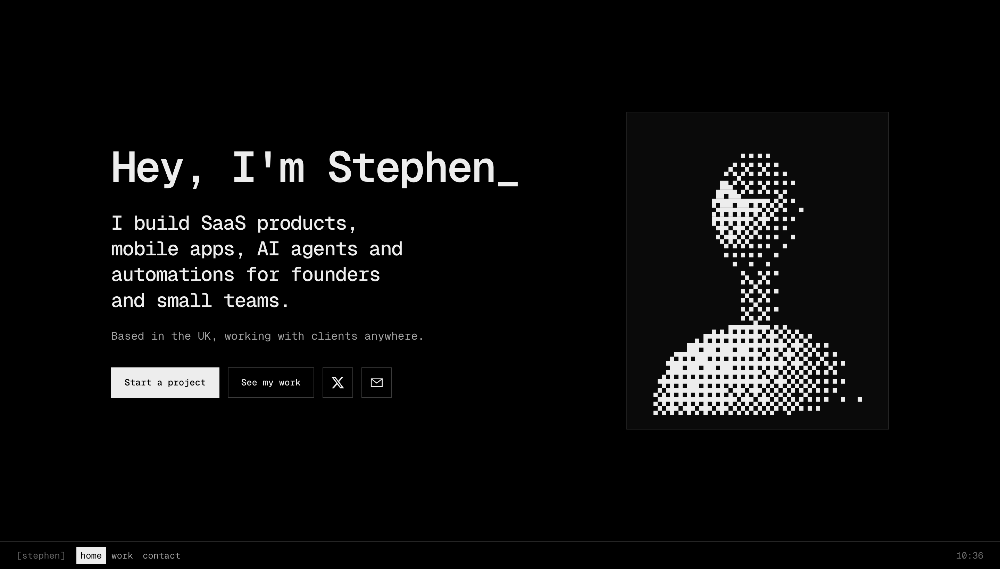

# Stephen Ojogbede

My freelance portfolio. I build SaaS products, mobile apps, AI agents and automations for founders and small teams.



## What's on the page

One dark, monochrome page in the spirit of an old terminal, with three sections:

- **Home.** A typed greeting, a short intro and a dithered ASCII portrait.
- **Work.** A browser for three products I designed, built and launched solo: [Postverse](https://postverse.io), [Muna](https://apps.apple.com/gb/app/muna-sole-trader-tax-ai/id6765894688) and [Foldr](https://apps.apple.com/gb/app/foldr-save-organize-videos/id6774282659).
- **Contact.** A form that opens your email app with your message filled in.

## How it's built

Hand-written HTML, CSS and vanilla JavaScript. No framework, no build step, no dependencies.

```
index.html   markup and copy
styles.css   all styles
script.js    greeting, work browser, portrait and contact form
```

It respects `prefers-reduced-motion` and works from the keyboard. Without JavaScript, every project is still readable.

## Run it locally

Serve the folder and open http://localhost:8000:

```sh
python3 -c "
import http.server as s
class NoCache(s.SimpleHTTPRequestHandler):
    def end_headers(self):
        self.send_header('Cache-Control', 'no-store')
        super().end_headers()
s.test(HandlerClass=NoCache, port=8000, bind='localhost')
"
```

This sends `Cache-Control: no-store`, so the browser always picks up your latest `script.js`. Plain `python3 -m http.server` works too, but Chrome may keep a stale copy.

## Deploy

The site is built for GitHub Pages. In the repo settings, under Pages, deploy from the `main` branch root.

## Contact

Email me at [ojogbedestephen@gmail.com](mailto:ojogbedestephen@gmail.com) or find me on X at [@steojodev](https://x.com/steojodev).
